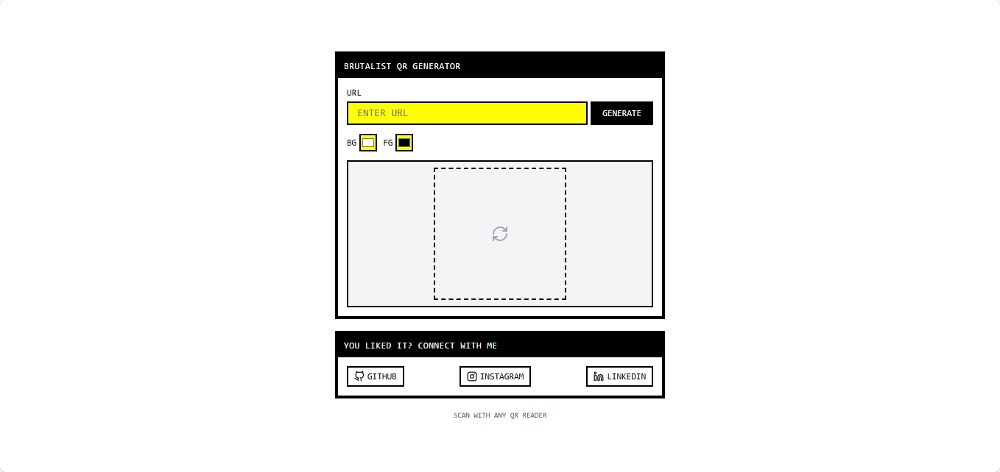

# Brutalist QR Code Generator

A sleek, brutalist-style QR code generator built with **Next.js**, **Tailwind CSS**, and **react-qr-code**. Create customizable QR codes with full control over foreground and background colors. Fast, minimal, and designed for aesthetic lovers of the brutalist web.



## 🚀 Features

* 🌀 Brutalist UI inspired by old-school interfaces
* 🎨 Customizable background and foreground colors
* ⚡ Built with modern tech stack (Next.js, Tailwind CSS, TypeScript)
* 🧾 QR generation powered by `react-qr-code`
* 📸 Export-ready QR codes for sharing or printing

## 🛠️ Tech Stack

* [Next.js 14 (App Router)](https://nextjs.org/)
* [Tailwind CSS](https://tailwindcss.com/)
* [TypeScript](https://www.typescriptlang.org/)
* [react-qr-code](https://github.com/rosskhanas/react-qr-code)

## 📁 Project Structure

```
brayanj4y-qrcode-generator/
├── app/                        # Next.js app directory
│   ├── globals.css
│   ├── layout.tsx
│   └── page.tsx
│
├── components/                # UI & logic components
│   ├── theme-provider.tsx
│   └── ui/                    # shadcn/ui components
│       ├── button.tsx
│       ├── input.tsx
│       ├── card.tsx
│       └── ...
│
├── hooks/                     # Custom React hooks
│   └── use-toast.ts
│
├── lib/                       # Utility functions
│   └── utils.ts
│
├── public/                    # Static files (images, etc.)
│   └── preview.png
│
├── styles/                    # Global styles
│   └── globals.css
│
├── package.json
├── tailwind.config.ts
├── tsconfig.json
├── next.config.mjs
└── README.md
```

## 📦 Installation

```bash
git clone https://github.com/yourusername/brayanj4y-qrcode-generator.git
cd brayanj4y-qrcode-generator
pnpm install
```

## 🔄 Running Locally

```bash
npm run dev
```

Open `http://localhost:3000` to view the app.

## 🧪 Usage

1. **Enter a URL** in the input field.
2. **Choose foreground (FG) and background (BG) colors**.
3. **Click Generate** to display the QR code.
4. **Scan with any QR reader** to test.

## 📄 License

[MIT](./LICENSE)

---

Built with 💛 by [@brayanj4y](https://github.com/brayanj4y).


